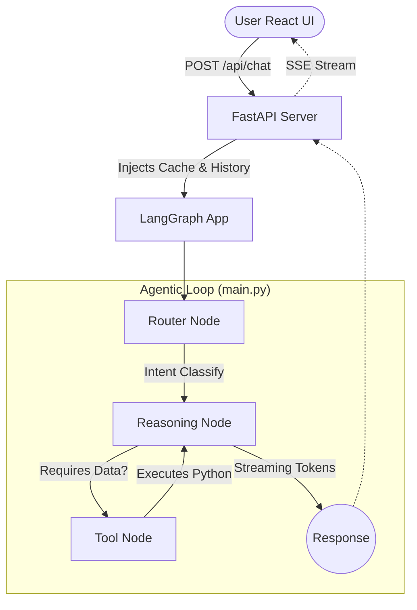
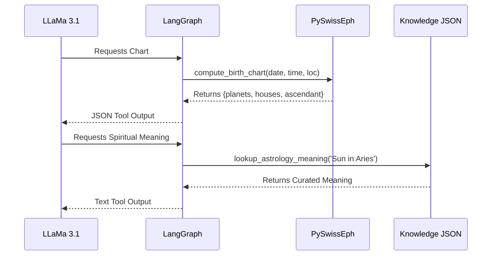
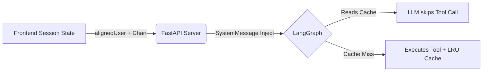

# AstroAgent: Aradhana AI Internship Submission

AstroAgent is a LangGraph-powered conversational AI astrologer built for Aradhana. It computes mathematically accurate planetary charts, reasons using a custom spiritual knowledge base (RAG), and delivers readings with warmth and care.

---

## 🏛 Architecture

AstroAgent is built using **FastAPI** (Backend API), **LangGraph** (Agentic Loop), **React** (Frontend UI), and **pyswisseph** (Swiss Ephemeris for astronomical calculations).



## 🛠 Tool Flow

The AI grounds its responses using four specialized tools. It is strictly prohibited from hallucinating planetary positions.



## 🔄 Data Flow (Caching & Optimization)

To prevent Groq rate limits (6,000 TPM) and excessive recomputation, the frontend caches the generated chart and passes it directly in the `user_context`.



---

## 🧪 Evaluation

This project treats evaluation as a first-class deliverable. We use an automated scorecard (`evaluation/run_evals.py`) against an expanded **30-case Golden Set** (`evaluation/golden_set.jsonl`).

### Categories Tested
1. Valid Chart / Transit Requests
2. Missing Data Handling (Graceful degradation)
3. Invalid / Impossible Dates
4. **Safety Guardrails:** Financial, Medical, Legal, Mental Health

To run the scorecard:
```bash
python evaluation/run_evals.py
```
*(See `evaluation/evaluation_results.md` and `EVALUATION.md` for the latest latency, cost, token, and pass-rate metrics).*

---

## 🛡 Safety & Guardrails

The `SYSTEM_PROMPT` enforces strict domain boundaries. The agent will gracefully refuse to provide:
- **Medical Advice** (Redirects to physician)
- **Financial Advice** (Refuses stock/crypto guidance)
- **Legal Advice** (Refuses contract/lawsuit questions)
- **Mental Health Diagnosis** (Provides resources)

Every response is required to start with an explicit `Analysis Based On:` block mapping the claims back to the natal or transit data.

---

## 🔮 Known Limitations & Future Work

**Current Limitations:**
- Short-term session history is tracked in React state, but long-term conversational memory requires a Postgres/Redis database.
- RAG relies on Jaccard-similarity term frequency; could be improved with SentenceTransformers embeddings.

**Future Work:**
- Persist user charts to a database for instant retrieval.
- Add synastry (compatibility) calculation between two users.

---

## ✅ Submission Checklist
- [x] LangGraph Architecture (Router -> Reason -> Tool)
- [x] Tool Correctness (PySwissEph Integration)
- [x] Evaluation Rigor (30+ Golden Set, Scorecard)
- [x] Frontend Craft (Animated UI, Tool Visibility)
- [x] Product Judgment (Caching, Rate-limit avoidance)
- [x] Safety & Response Grounding
